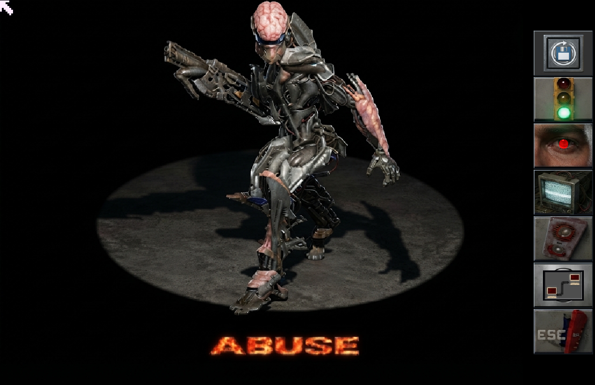
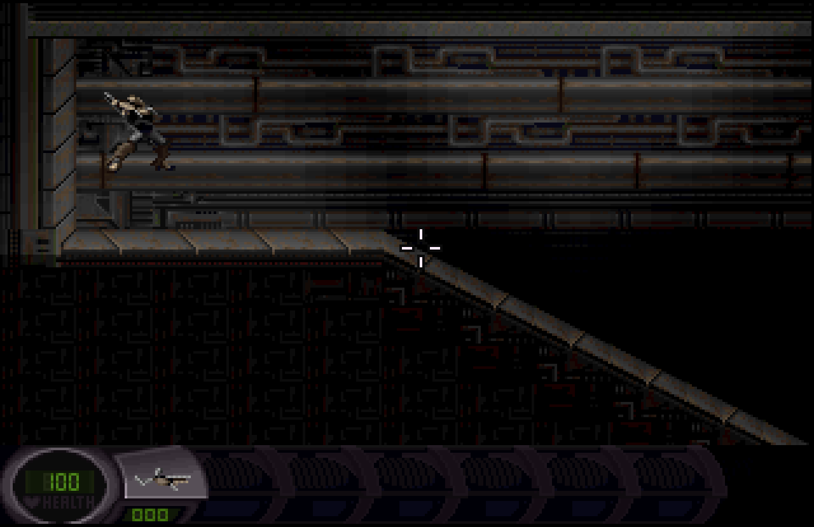
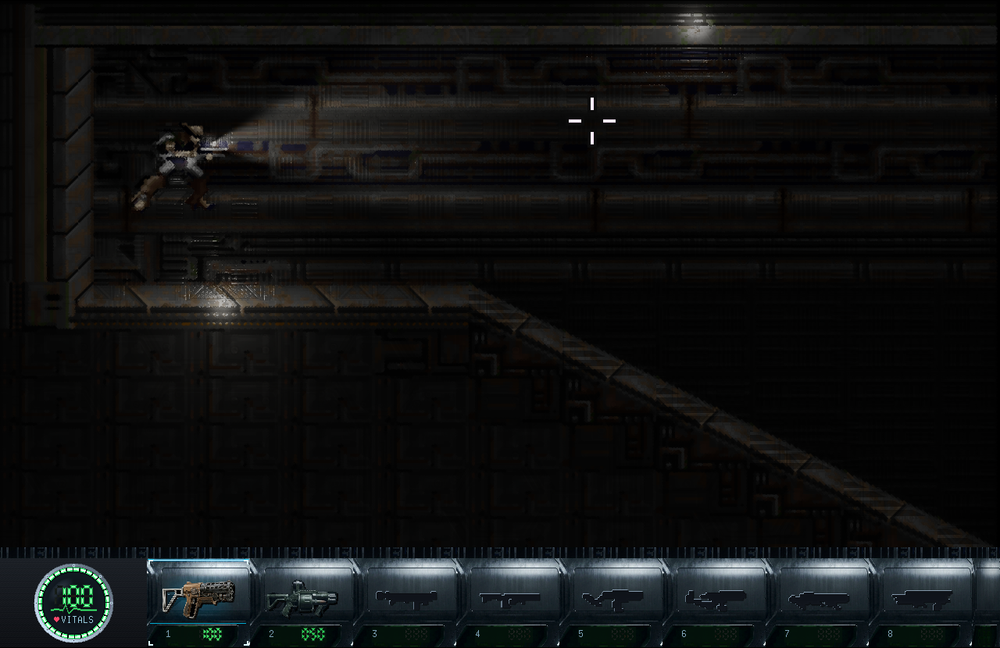
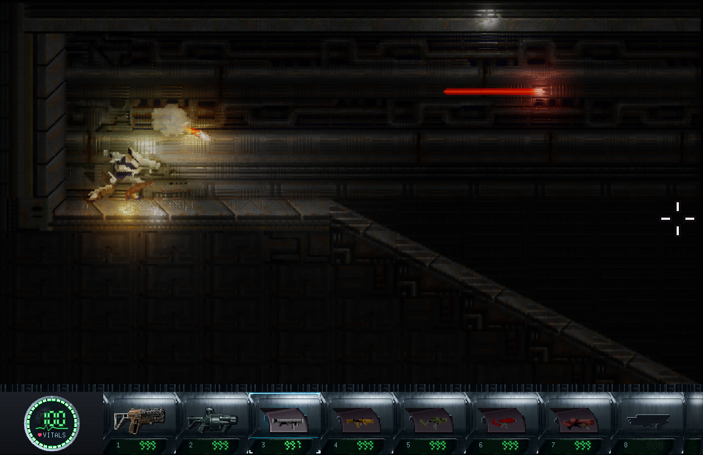
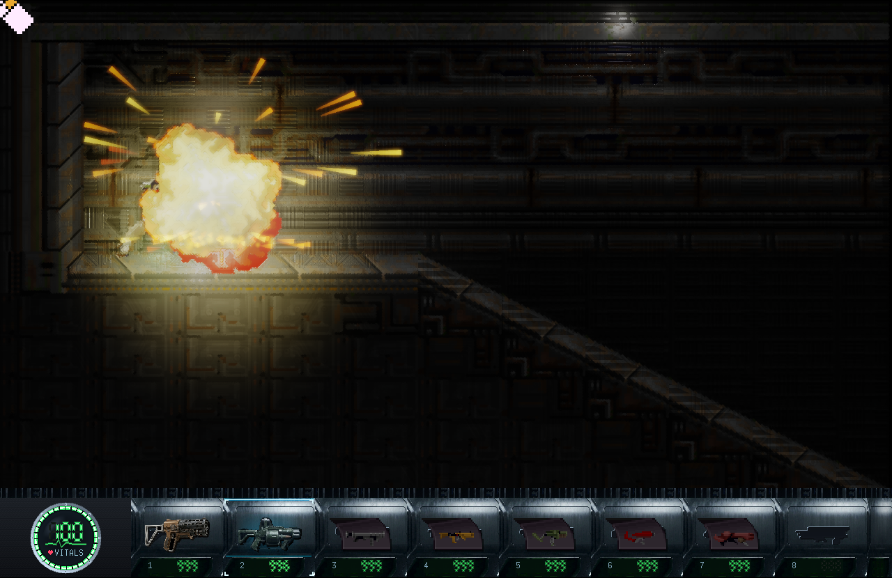
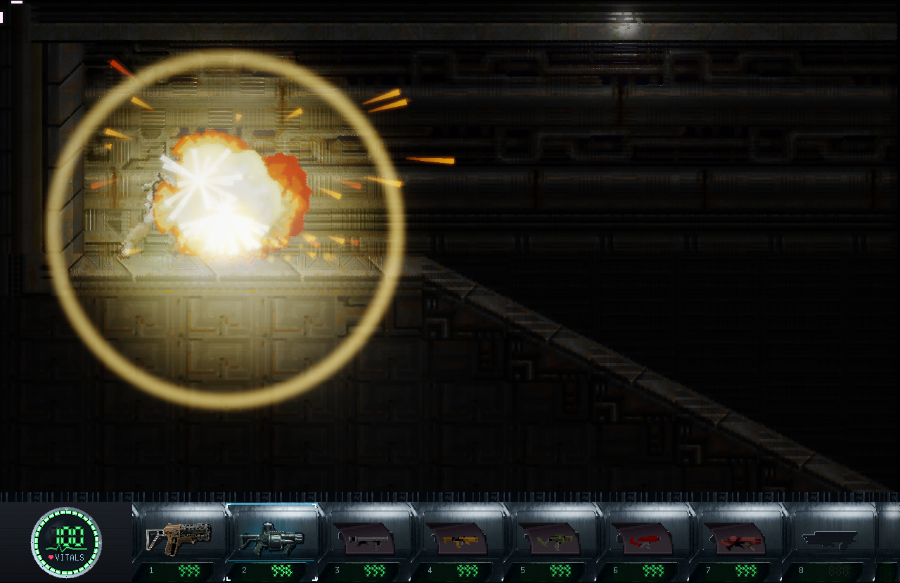
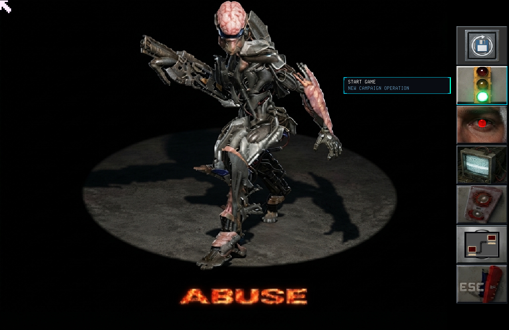
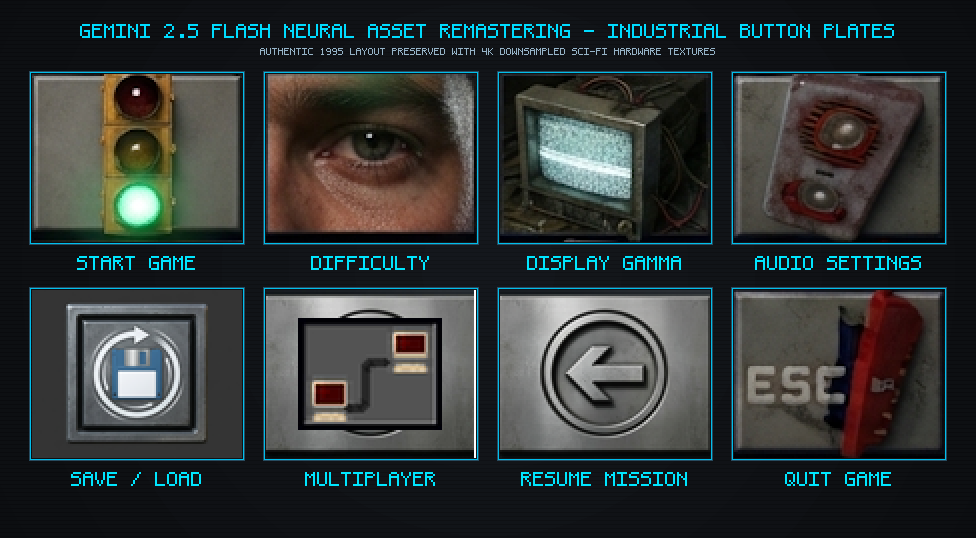
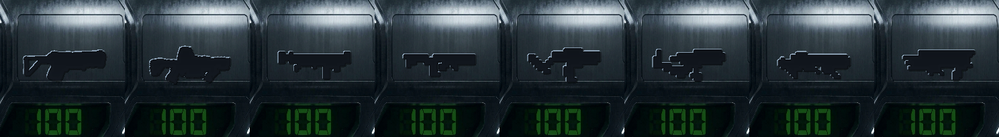

# ABUSE 2026: REMASTERED

<p align="center">
  
</p>

<p align="center">
  <strong>The definitive next-generation restoration of Crack dot Com's 1995/1996 cyberpunk action-platformer masterpiece.</strong><br>
  <em>Rebuilt with a Modern 2D Deferred GPU Pipeline, Real-Time Raytracing, 4-Channel PBR Normal Mapping, and Gemini-crafted HD Textures — while preserving 100% of the original physics, collision geometry, and soul.</em>
</p>

<p align="center">
  
  
  
  
  
  
</p>

---

> [!IMPORTANT]
> ### ⚡ 2026 NEXT-GEN ENGINE: REAL-TIME 2D RAYTRACING & PBR DEFERRED PIPELINE
> This is **NOT** a simple bilinear filter, an emulator overlay, or a flat post-processing CRT shader.
>
> **Abuse 2026** introduces a complete **Multi-Target G-Buffer Deferred GPU Pipeline (OpenGL 3.3 Core)** integrated directly into the native 1995 C++ engine:
> - **Real-Time 2D Raymarched Dynamic Shadows:** Raymarching casts soft penumbra shadows across walls, floors, and catwalks in real time from tactical flashlights, muzzle flashes, and in-flight projectiles.
> - **4-Channel PBR Normal Mapping:** High-resolution normal vectors provide tactile depth and metallic relief to diamond-plate walkways, industrial conduits, hydraulic bulkheads, and bio-growth.
> - **Dynamic Surface-Normal Ballistics ($\vec{n}$):** Projectiles, sparks, and incandescent debris compute exact geometric collision normals ($\vec{v} \cdot \vec{n} > 0$), ricocheting outwards with zero wall or floor clipping.
> - **Diegetic Volumetric Atmosphere & HDR Reflections:** Soft ambient light scattering, atmospheric dust, and real-time floor reflections that bring the underground facility to life.
> - **Authentic Retro Preservation:** Switch seamlessly on the fly (<kbd>F2</kbd>) between 100% original 1995 MS-DOS VGA software rendering and modern 2026 Raytraced PBR.

---

## 🕹️ In Memory of a Legend: 30 Years of Abuse

In 1995, **Crack dot Com** (founded by Jonathan Clark and Dave Taylor) released *Abuse*, an unrelenting sci-fi side-scrolling shooter that revolutionized PC gaming by pairing 360-degree precision mouse aiming with fluid keyboard movement years before dual-stick and mouse-aiming conventions became standard.

Many of us grew up clutching a ball mouse in the dark, exploring the claustrophobic corridors of a high-security underground facility infected by the horrifying mutagenic virus known as *Abuse*.

**Abuse 2026** is a passion-driven overhaul created by and for players who love this game. It delivers the atmospheric depth and tactile fidelity of a high-end modern 2026 indie release, while keeping movement, collision, timing, and enemy AI identical to the 1995 original.

---

## 📸 Visual Showcase: Before & After

### ⚔️ In-Game Visual Contrast: 1995 Classic vs 2026 Remaster
*Toggle between both engines live during gameplay with <kbd>F2</kbd>!*

| 🕹️ Classic 1995 (Untouched MS-DOS VGA 320x200) | ⚡ Remaster 2026 (Modern PBR + 2D Raytracing) |
|:----------------------------------------------:|:---------------------------------------------:|
|  |  |
| *Original 256-color palette, flat ambient light, classic statusbar.* | *Real-time raymarched shadows, metallic PBR normal maps, tactical flashlight, modular HUD.* |

---

### 💥 Combat in Action: Dynamic Projectile Lighting & Muzzle Flash
<p align="center">
  <br>
  <em>Active combat: Rocket launcher discharge producing dynamic muzzle flash, illuminating background conduits and piping in real time as projectiles streak through the dark corridors.</em>
</p>

---

### 💥 High-Speed Ballistics & Surface-Normal Ricochet
*Explosion shockwaves, incandescent shrapnel, and sparks dynamically calculate surface normals ($\vec{n}$) with zero floor clipping.*

| Instant Shockwave & 360° Sparks | Normal-Aware Ramp Bounce Physics |
|:-------------------------------:|:--------------------------------:|
|  |  |
| *Rapid explosive expansion, incandescent falling shrapnel, and audited soft ambient lighting.* | *Spherical shockwave and ballistic sparks reflected along the exact 45° normal of the catwalk ramp.* |

---

### 🎨 Authentic Gemini HD Title Screen & Button Plates
*The iconic 1995 menu composition restored with high-definition industrial hardware button plates generated with Gemini 2.5 Flash.*

| Remastered Title Screen | Interactive Holographic Tooltips |
|:-----------------------:|:--------------------------------:|
|  |  |

<p align="center">
  <br>
  <em>High-definition button plate array: Start Game, Difficulty, Display Gamma, Audio Settings, Save/Load, Multiplayer, Resume Mission, and Quit.</em>
</p>

---

### 🎛️ Modular 3D Metallic Statusbar Dashboard
<p align="center">
  <br>
  <em>8 dedicated modular weapon bays with illuminated weapon silhouettes, glowing active selection frames, digital 7-segment LED ammo counters, and integrated biometric suit vitals monitor.</em>
</p>

---

## ✨ Key Remaster Features

### 💡 1. Modern 2D Deferred GPU Pipeline & Raytracing
- **Multi-Target G-Buffer:** Renders native sprite geometry into high-precision Albedo, Normal, and Emission/Material buffers.
- **2D Raymarched Dynamic Shadows:** Real-time penumbra filtering with distance-attenuated soft shadows casting from the player's tactical flashlight, muzzle flashes, and alien biosensors.
- **Normal Mapping (PBR Relief):** Deep tactile relief across industrial metal bulkheads, diamond-plate catwalks, ventilation grills, and alien bio-growth.
- **Volumetric Fog & Scattering:** Atmospheric dust scattering, light shafts (*god rays*), and cinematic haze.
- **HDR Bloom & Real-Time Floor Reflections:** Weapon beams, radioactive vats, and plasma explosions illuminate the world and cast reflections on wet metallic floors.
- **Audited Lighting Levels:** Balanced, delicate cinematic lighting. No blown-out flares or radioactive green washes — dark, brooding, and atmospheric.

### 💥 2. Dynamic Ballistics & Normal-Aware Particles
- **Surface Normal Detection ($\vec{n}$):** Colisiones contra rampas a 45°, paredes, pisos y techos detectan la inclinación vectorial exacta de la superficie.
- **Zero Wall Penetration:** Cono de dispersión confinado estrictamente al hemisferio exterior ($\vec{v} \cdot \vec{n} > 0$) con desfase de eyección de 2.5 px para erradicar cualquier partícula que atraviese la geometría.
- **Incandescent Shrapnel & Debris:** Metralla balística pesada con física de gravedad acelerada y rebote elástico que choca contra rampas y pisos, enfriándose de amarillo incandescente a rojo brasa.
- **Ultra-Fast Dynamics:** Animaciones y tiempos de vida reducidos un 75% para una respuesta visceral, rápida e hiperreactiva.

### 🎨 3. Authentic Gemini HD Main Menu
- **Original 1996 Layout Preserved:** Restored the iconic central spotlight featuring the biomechanical alien and the burning *ABUSE* logo, stripping away invasive modern UI docks.
- **Gemini AI High-Definition Button Plates (105x84):**
  - **Start Game:** Tactical red-amber-green traffic light.
  - **Difficulty:** Industrial profile of Nick Vrenna, featuring a piercing cybernetic crimson eye on *Extreme* difficulty.
  - **Gamma Calibration:** Vintage CRT monitor chassis.
  - **Audio Settings:** Heavy-duty emergency siren and intercom.
  - **Multiplayer:** Networked retro terminals.
  - **Load Game:** 3.5" magnetic floppy disk.
  - **Resume Mission:** Stamped industrial steel chevron.
  - **Quit to Desktop:** Safety-caged red emergency toggle switch.
- **Sleek Holographic Tooltips:** Translucent dark glass badges with neon borders and descriptive mission parameters floating gracefully next to the hovered button.
- **Rock-Solid Click Pipeline:** Re-engineered SDL event processing (`SDL_MOUSEBUTTONDOWN/UP` per-event coordinates) to ensure 100% click registration on macOS trackpads, high-DPI displays, and high-frequency mice.

### 🎛️ 4. Modular 3D Metallic HUD Chassis
- 8 dedicated weapon bays with illuminated silhouettes and 7-segment LED ammo readouts.
- High-visibility bio-suit health & heart rate monitor.
- Instant weapon hot-swapping with smooth transition animations.

### ⚡ 5. Modern Performance & Widescreen
- **Uncapped Refresh Rates:** High-FPS decoupling supporting 120Hz, 144Hz, and 240Hz monitors with smooth sub-tick visual interpolation.
- **Smart Aspect Ratio Scaling:** Native support for 16:9, 16:10, and Ultrawide (21:9) monitors with crisp, seamless pillarboxing.
- **Modern Controller Support:** Full analog dual-stick aiming, customizable deadzones, and vibration hooks.

---

## 🚀 Quickstart: Clone & Play in 60 Seconds

The repository is pre-configured for a pristine, out-of-the-box experience (debug modes and on-screen metrics are disabled by default).

### 🍎 macOS

```bash
# 1. Install dependencies via Homebrew
brew install cmake sdl2 sdl2_mixer

# 2. Clone the repository
git clone https://github.com/MBerguer/Abuse_2026.git
cd Abuse_2026

# 3. Build and install the macOS application bundle
cmake -B build -DCMAKE_BUILD_TYPE=Release
cmake --build build -j$(sysctl -n hw.ncpu)
cmake --install build

# 4. Launch and play!
open abuse.app
# (or run directly from terminal: ./abuse.app/Contents/MacOS/abuse)
```

### 🐧 Linux (Ubuntu / Debian / Fedora / Arch)

```bash
# Ubuntu / Debian dependencies
sudo apt-get update
sudo apt-get install -y build-essential cmake libsdl2-dev libsdl2-mixer-dev libgl1-mesa-dev

# Fedora
# sudo dnf install gcc-c++ cmake SDL2-devel SDL2_mixer-devel mesa-libGL-devel

# Arch Linux
# sudo pacman -S base-devel cmake sdl2 sdl2_mixer

# Build
cmake -B build -DCMAKE_BUILD_TYPE=Release -DCMAKE_INSTALL_PREFIX=.
cmake --build build -j$(nproc)
cmake --install build

# Launch
./abuse
```

---

## 🎮 Controls

### Default Keyboard & Mouse
| Action | Binding |
|:---|:---|
| **Move Left / Right** | <kbd>A</kbd> / <kbd>D</kbd> or <kbd>←</kbd> / <kbd>→</kbd> |
| **Jump / Aim Up** | <kbd>W</kbd> or <kbd>↑</kbd> |
| **Crouch / Activate / Down** | <kbd>S</kbd> or <kbd>↓</kbd> |
| **Aim Weapon** | Mouse Cursor (360°) |
| **Fire Weapon** | <kbd>Left Mouse Button</kbd> |
| **Special Power (Boots / Speed / Cloak)** | <kbd>Right Mouse Button</kbd> |
| **Next / Previous Weapon** | <kbd>Mouse Scroll</kbd>, <kbd>E</kbd> / <kbd>Q</kbd>, or <kbd>1</kbd>–<kbd>7</kbd> |
| **Tactical Flashlight (On/Off)** | <kbd>Shift</kbd> |
| **Quick Save (at save consoles)** | <kbd>F5</kbd> |
| **Quick Load** | <kbd>F9</kbd> |
| **Pause Game** | <kbd>P</kbd> |
| **In-Game Menu / Cancel** | <kbd>Esc</kbd> |

### Hotkeys & Engine Toggles
| Key | Function |
|:---|:---|
| <kbd>F2</kbd> | **Cycle Render Modes:** Classic 1995 VGA $\leftrightarrow$ Classic + RT $\leftrightarrow$ Next-Gen HD PBR |
| <kbd>F3</kbd> | **Toggle 2D Raytraced Shadows** (On / Off) |
| <kbd>F4</kbd> | **Toggle Normal Mapping Depth** (On / Off) |
| <kbd>F6</kbd> | **Toggle CRT Curvature & Scanlines Shader** |
| <kbd>F7</kbd> | **Toggle High-FPS Simulation Decoupling** (120/144Hz+) |
| <kbd>F8</kbd> | **Toggle Tactical Flashlight** |
| <kbd>F10</kbd> | **Toggle Positional & Tile Debug HUD** (Off by default) |
| <kbd>F11</kbd> | **Capture High-Resolution Screenshot** |
| <kbd>F12</kbd> | **Toggle 3D Modular Statusbar Dashboard** |

---

## 🛠️ Configuration

Configuration is saved in `config.txt` inside your user directory:
- **macOS:** `~/Library/Application Support/abuse/data/config.txt`
- **Linux:** `~/.local/share/abuse/data/config.txt`
- **Windows:** `%APPDATA%\abuse\data\config.txt`

Key settings you can tune:
```ini
fullscreen=0          ; 0 = Windowed, 1 = Fullscreen Borderless, 2 = Exclusive Fullscreen
screen_width=1920     ; Output window width
screen_height=1080    ; Output window height
vsync=1               ; Enable vertical synchronization
volume_sound=110      ; SFX Volume (0-127)
volume_music=90       ; MIDI Volume (0-127)
```

---

## 🤝 Contributing

**Abuse 2026 is an active, open-source community effort, and help is warmly welcomed!**

Many of us grew up with this groundbreaking game, and the goal of this project is to preserve and celebrate its legacy for the next 30 years. Whether you are a C++ programmer, OpenGL graphics shader wizard, pixel artist, 3D modeler, level designer, or retro gaming enthusiast, there is plenty of exciting work ahead.

### 🗺️ Future Roadmap & Open Opportunities
- [ ] **Interactive Save Terminal Remaster (`AR_LOADSAVE`):** Modernizing the in-game wall terminals into high-definition diegetic consoles with CRT previews and sleek slot selectors.
- [ ] **Expanded HD Texture Sets:** Generating additional 4-Channel PBR normal maps for alien caverns, sewer drainage, and alien boss chambers.
- [ ] **Modern Cross-Platform Multiplayer:** Overhauling the retro socket protocol with modern low-latency rollback / client-prediction networking for internet play.
- [ ] **Steam Deck & Gamepad Haptics:** Custom controller profiles, rumble/haptic triggers for weapon recoil, and native Steam Deck UI scaling.
- [ ] **Translations & Lore Expansion:** Community localizations and archival preservation of original design documents.

### How to Contribute
1. **Fork the repository** and create your branch from `master`:
   ```bash
   git checkout -b feature/awesome-feature
   ```
2. **Follow code style conventions** (preserve engine comments, keep shader code clean and commented).
3. **Test your changes** across windowed and fullscreen modes.
4. **Submit a Pull Request** with a detailed explanation of your improvements and screenshots if visual changes were made.
5. Feel free to open an **Issue** to discuss feature ideas, report bugs, or share custom level packs!

---

## 📜 Historical Acknowledgments & Credits

- **Crack dot Com (1995–1996):** Jonathan Clark, Dave Taylor, and the original developers who built the greatest 2D run-and-gun platformer of the 90s and generously open-sourced the code.
- **Port Maintainers (1997–2025):**
  - **Anthony Kruize:** Original Linux/SDL port (2001).
  - **Jeremy Scott:** Windows 32-bit port (2001).
  - **Sam Hocevar:** Modern SDL port cleanup & autotools (2005–2011).
  - **Xenoveritas:** SDL2 modernization port (2014).
  - **Antonio Radojkovic (antrad):** *Abuse 1996* project enhancements (gamepad, high-res menus, modern fixes).
- **Abuse 2026 Team & Contributors:** The next-gen deferred renderer, 2D raytracing pipeline, Gemini HD asset generation, and modern physics overhaul.

---

<p align="center">
  <em>"Falsely accused. Inhumanly imprisoned. Heavily armed."</em><br>
  <strong>ABUSE 2026 — Ready to run. Clone and play!</strong>
</p>
